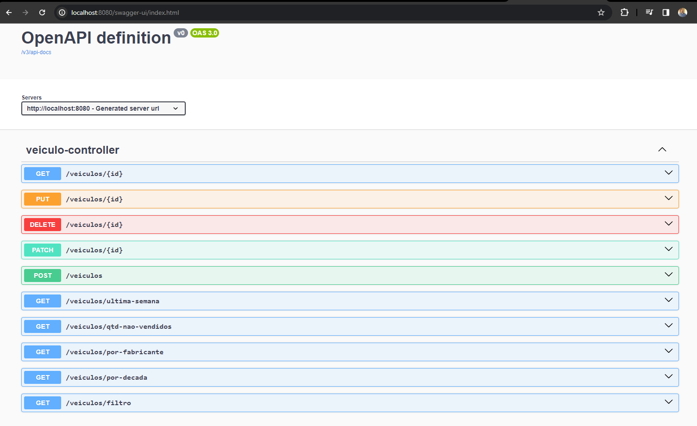

<body>
<h1 style="text-align: center;"> Api Veiculos </h1>

<h2> Technologias utilizadas </h2>
<ul>
<li>Java 17 </li>
<li>Maven 3.9.6 </li>
<li>Springboot 3.1.11 </li>
<li>Hibernate/JPA</li>
<li>H2 database </li>
<li>Flyway </li>
</ul>

<h2> Rodando a aplicação </h2>
<ol>
<li>Gerando o jar da aplicação com o comando "mvn clean package"</li>
<li>Executar projeto "java -jar ./target/veiculos-0.0.1-SNAPSHOT.jar"</li>
<li>Ou simplesmente rodar a classe main na IDE IntelliJ</li>
</ol>

<h2> Descrição do Projeto </h2>
<ol>
<li>Realiza cadastro veiculos atravez endpoint do tipo Post.</li>
<li>Realiza edição todos dados veiculo atravez do endpoint do tipo Put.</li>
<li>Realiza edição parcial dados veiculo atravez do endpoint do tipo Patch.</li>
<li>Realiza consulta de veiculo especifica pelo id, atravez do endpoint tipo Get.</li>
<li>Realiza consulta de todos veiculos atravez do endpoint do tipo Get.</li>
<li>Realiza consulta de todos veiculos ultima semana atravez do endpoint do tipo Get.</li>
<li>Realiza consulta de todos veiculos por fabricante atravez do endpoint do tipo Get.</li>
<li>Realiza consulta de todos veiculos por decada atravez do endpoint do tipo Get.</li>
<li>Realiza consulta personalizada atravez de filtros do endpoint do tipo Get.</li>
<li>Realiza consulta informando quantidade de veiculos não vendidos atravez do endpoint do tipo Get.</li>

<h5>Observação</h5>
Os dados estão sendo salvos em uma base H2.
</ol>

<h2> Validações Veiculos / Uso </h2>
<ol>
<li>Caso tente realizar edição de um veiculo a aplicação verifica se o veiculo está com status vendido true, 
caso esteja a aplicação lança exceção informado que "Veículo vendido não pode ser editado".
 
Caso o veiculo esteja com status vendido false, aplicação permite realizar edição.
</li>
<li>Foi adicionado também a validação tanto no cadastro quanto na edição veiculos referente a marca/fabricante .
Caso o nome da marca não contenha no Marcaenum da aplicação o sistema lança exceção informando : "Não foi encontrado Marca com o nome informado",
para manter a consistência das marcas fornecidas.
</li>
</ol>

<h2> Documentação Swagger </h2>
 Foi disponibilizado a documentação da api atravez do Swagger no link
<a>http://localhost:8080/swagger-ui/index.html</a> ,basta subir aplicação local.

  

<h2> Observação </h2>
Foi utilizado o Flyway para controle de versão da base de dados , e também inserção de dados 
para testes, foi inserido um script para inserção de dados para década de 1990 e 2000 de algumas fabricantes contidas no enum 
para caso quiser realizar pesquisas sem adicionar dados e realizar quaisquer outras operações.

Para acessar base dados disponivel no link = <a>http://localhost:8080/h2-console</a>  e inserir as informações JDBC URL: jdbc:h2:mem:3306/veiculos, Username:root, Password:root

  

<h2> Cobertura testes service </h2>

  

</body>

